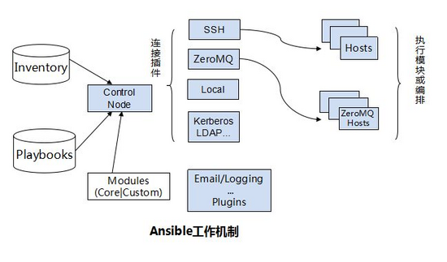

# 初识ansible

Ansible是一个开源自动化平台。能够在配置管理、应用程序部署、任务序列化、任务自动化上提供帮助。

- 主要作用
    1. 自动化部署 application
    2. 自动化管理配置项
    3. 自动化的持续交互
    4. 自动化的(AWS)云服务管理

- **参考**

    1. [ansible 官网](https://www.ansible.com/)
    2. [What is Ansible?](https://networklore.com/ansible/)
    3. [官方文档库](https://docs.ansible.com/)
    4. [Ansible 中文权威指南](http://www.ansible.com.cn/)
    5. [ansible 的 github地址](https://github.com/ansible/ansible)

 - 依赖

    - 管理主机的要求
        1. ansible默认通过SSH协议管理机器。
        2. python 2.6/2.7。
        3. PyYAML。

    - 托管节点的要求
        1. 通常使用SSH与托管节点通信，默认使用 sftp。如果 sftp 不可用，可配置成 scp 方式。
        2. 如果托管节点上开启了SELinux，需要安装 libselinux-python。

- 工作机制  

ansible 与 puppet 等相比，其号称是 agentless 的，而且这个也确实在很多台机器上进行运维时不用一台一台安装或者升级客户端确实带来了一定的便利。原理在于其将要执行的命令或者脚本通过 sftp 的方式传到要执行的对象机器，然后通过 ssh 远程执行，执行之后清理现场将 sftp 传过去的文件删除。

1. ansible 架构  

2. ansible 工作机制  


    名词解释:  
    1. Ansible: ansible
    2. Modules: 包括 Ansible 自带的核心模块及自定义模块
    3. Plugins: 完成模块功能的补充，包括连接插件、邮件插件等
    4. PlayBooks: 定义 Ansible 多任务配置文件，由Ansible 自动执行
    5. Inventory: 定义 Ansible 管理主机的清单

3. 工作原理解释:  
    1. 管理端支持 ssh 方式连接被管理端(还有 local 和 zeromq 方式进行管理, 目前还未理解这两种方式的原理, 故不在这里体现)。
    2. 可以按应用类型等方式进行Host Inventory（主机群）分类，管理节点通过各类模块实现相应的操作。
    3. 管理节点可以通过 playbooks 实现多个 task 的集合实现一类功能, 如 web 服务的安装部署, 数据库服务器的批量备份等。 playbooks 我们可以简单的理解为, 系统通过组合多条 ad-hoc 操作的配置文件。

## 安装

    1. 从源码安装
    2. 通过 yum 安装

### 通过源码安装

    1. 获取源码

```
git clone https://github.com/ansible/ansible.git
cd ./ansible
```
    2. python依赖

```
sudo pip install paramiko PyYAML Jinja2 httplib2 six
```

    3. 使用bash

```
source ./hacking/env-setup
```

**注意** 一旦运行env-setup脚本,就意味着Ansible从源码中运行起来了。

### 使用yum安装最新发布的版本

    **通过Yum安装RPMs适用于 EPEL 6, 7, 以及仍在支持中的Fedora发行版，RHEL和CentOS用户需要配置EPEL**

```bash
# install the epel-release RPM if needed on CentOS, RHEL, or Scientific Linux
sudo yum install ansible
```

## 基本使用ansible

### 编辑/etc/ansible/hosts，加入一个或多个远程系统。

配置/etc/ansible/hosts

添加主机

### 初次尝试

可以通过 ```ansible -h``` 获得详细使用。

```
# 未配置authorized_key
 ansible all -m ping --ask-pass
 只需要填写未配置authorized_key的server

 # 完成配置authorized_key后
 ansible all -m ping
```

-v的选项是显示出详细信息。ansible支持三种显示信息的方式:

```
-v
-vv
-vvv
```

如果不想使用 ssh-agent, 想通过密码验证的方式使用 SSH,可以在执行ansible命令时使用 --ask-pass (-k)选项, 官方建议使用 ssh-agent。

### ansible配置

主要是配置 ```/etc/ansible/hosts``` 文件, 在该文件中配置需要通过 ansible 管理的主机。

## 使用ansible

Ansible提供两种方式去完成任务,一是 ad-hoc 命令,一是写 Ansible playbook.前者可以解决一些简单的任务, 后者解决较复杂的任务。

### ad-hoc

一些命令去比较快的完成一些命令,而不需要将这些执行的命令特别保存下来, 这样的命令就叫做 ad-hoc 命令，主要用来解决一些简单的任务。

```
# 重启 Atlanta 组中所有的 web 服务器，每次重启10个。
ansible atlanta -a "/sbin/reboot" -f 10"

# 使用<user\>重启 Atlanta 组中所有的 web 服务器，每次重启10个。
ansible atlanta -a "/usr/bin/foo" -u <user\>

# 通过sudo执行
ansible atlanta -a "/usr/bin/foo" -u <user\> --sudo [--ask-sudo-pass]

# 也可以通过``–sudo-user`` (-U)选项,使用 sudo 切换到其它用户身份
ansible atlanta -a "/usr/bin/foo" -u <user\> -U <otheruser\> [--ask-sudo-pass]
```

**Note:command 模块不支持 shell 变量,也不支持管道等 shell 相关的东西.如果你想使用 shell相关的这些东西, 请使用’shell’ 模块。**

- 使用 shell 模块的示例：

```
ansible raleigh -m shell -a 'echo $TERM'
```

- File Transfer

    1. Ansible 能够以并行的方式同时 SCP 大量的文件到多台机器：

```shell
ansible webservers -m copy -a 'src=/root/anaconda-ks.cfg dest=/root'
ansible webservers -m copy -a 'src=/root/anaconda-ks.cfg dest=/root' --ask-pass

# 结果

ansible03 | SUCCESS =\> {
    "changed": true,
    "checksum": "71ebc4d84ae57d7b350d98b3fa857dc99523706c",
    "dest": "/root/anaconda-ks.cfg",
    "gid": 0,
    "group": "root",
    "md5sum": "5fa1db31b175f589eedf1ac29afdd2aa",
    "mode": "0600",
    "owner": "root",
    "secontext": "system_u:object_r:admin_home_t:s0",
    "size": 1659,
    "src": "/root/.ansible/tmp/ansible-tmp-1497496524.94-102234852322108/source",
    "state": "file",
    "uid": 0
}
```

    2. 使用 file 模块可以做到修改文件的属主和权限：

```shell
ansible webservers -m file -a "dest=/srv/foo/a.txt mode=600"
ansible webservers -m file -a "dest=/srv/foo/b.txt mode=600 owner=mdehaan group=mdehaan"
```

    3. 使用 file 模块也可以创建目录,与执行 mkdir -p 效果类似:

```shell
ansible webservers -m file -a "dest=/path/to/c mode=755 owner=mdehaan group=mdehaan state=directory"


```

    4. 删除目录(递归的删除)和删除文件：

```shell
ansible webservers -m file -a "dest=/path/to/c state=absent"
```

- Managing Packages

nsible 提供对 yum 和 apt 的支持。

```shell
# 确认一个软件包已经安装,但不去升级它
ansible webservers -m yum -a "name=acme state=present"

# 确认一个软件包的安装版本
ansible webservers -m yum -a "name=acme-1.5 state=present"

# 确认一个软件包还没有安装
ansible webservers -m yum -a "name=acme state=absent"
```
可以使用 command 模块去安装软件。

- Users and Groups

使用 ‘user’ 模块可以方便的创建账户,删除账户,或是管理现有的账户

```shell
ansible all -m user -a "name=foo password=<crypted password here\>"
ansible all -m user -a "name=foo state=absent"
```

- Deploying From Source Control

直接使用 git 部署 webapp：

```shell
ansible webservers -m git -a "repo=git://foo.example.org/repo.git dest=/srv/myapp version=HEAD"
```

- Managing Services

- Time Limited Background Operations

- Gathering Facts


###  Ansible playbook


## 名词解释

**TODO**

- [sftp]()
- [EPEL](http://fedoraproject.org/wiki/EPEL)
